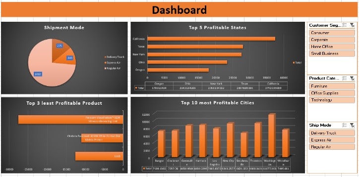

# 📊 Excel Sales Analysis Dashboard  

This repository contains an interactive **Excel Dashboard** designed to analyze sales data and provide actionable insights.  

Built using:  
- **Power Query** for data import and transformation  
- **Power Pivot & Data Modelling** for creating relationships between tables  
- **Pivot Tables & Pivot Charts** for summarizing key metrics  
- **Slicers and Timelines** for interactivity  

## ✨ Dashboard Highlights  
- **Sales Performance**: Total Sales, Profit, and Quantity Ordered  
- **Regional Insights**: Profit by Region, State, and City  
- **Shipping Analysis**: Orders by Shipping Mode  
- **Returns Tracking**: Easily view returned orders and calculate return rate  
- **Top/Bottom Products**: Identify the most and least profitable products  

## 🖼️ Preview  
  
*(Add a screenshot of your dashboard as `dashboard-preview.png` in the repo for this to show.)*

## 🚀 How to Use  
1. Download the file [`Excel_Dashboard_Sales_Analysis.xlsx`](./Excel_Dashboard_Sales_Analysis.xlsx).  
2. Open it in **Microsoft Excel** (desktop version recommended).  
3. Use the built-in slicers and timelines to explore the data interactively.  

## 🛠️ Tools & Techniques  
- Microsoft Excel (Power Query, Power Pivot)  
- Data Modelling  
- Pivot Tables & Charts  
- Dashboard Design & Formatting  

---

Feel free to ⭐️ this repository or fork it if you’d like to adapt the dashboard for your own use!
